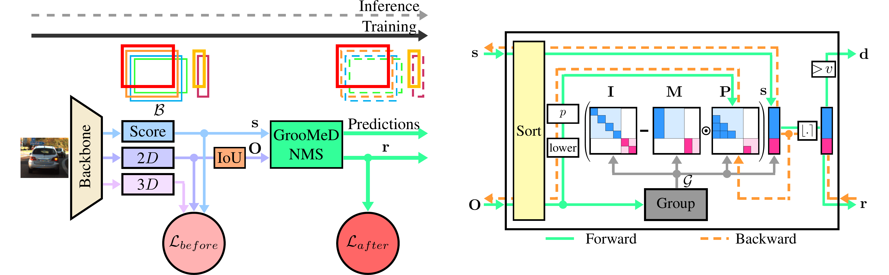

# GrooMeD-NMS: Grouped Mathematically Differentiable NMS for Monocular 3D Object Detection




[GrooMeD-NMS: Grouped Mathematically Differentiable NMS for Monocular 3D Object Detection](https://arxiv.org/pdf/2103.17202.pdf), [CVPR 2021](http://cvpr2021.thecvf.com/)

[Abhinav Kumar](https://sites.google.com/view/abhinavkumar/), [Garrick Brazil](https://garrickbrazil.com/), [Xiaoming Liu](http://www.cse.msu.edu/~liuxm/index2.html)

[project], [supp], [slides], [1min_talk], [demo](https://www.youtube.com/watch?v=PWctKkyWrno), [arxiv](https://arxiv.org/pdf/2103.17202.pdf)

This code is based on [Kinematic-3D](https://github.com/garrickbrazil/kinematic3d), such that the setup/organization is very similar. A few of the implementations, such as classical NMS, are based on [Caffe](https://caffe.berkeleyvision.org/install_apt.html).

## References

Please cite the following paper if you find this repository useful:
```
@inproceedings{kumar2021groomed,
  title={{GrooMeD-NMS}: Grouped Mathematically Differentiable NMS for Monocular {$3$D} Object Detection},
  author={Kumar, Abhinav and Brazil, Garrick and Liu, Xiaoming},
  booktitle={IEEE/CVF Conference on Computer Vision and Pattern Recognition (CVPR)},
  year={2021}
}
```


## Setup

- **Requirements**

    1. Python 3.6
    2. [Pytorch](http://pytorch.org) 0.4.1
    3. Torchvision 0.2.1
    4. Cuda 8.0
    5. Ubuntu 18.04/Debian 8.9

    This is tested with NVIDIA 1080 Ti GPU. Other platforms have not been tested. Unless otherwise stated, the below scripts and instructions assume the working directory is the project root. 
    
    Clone the repo first:
    ```bash
    git clone https://github.com/abhi1kumar/groomed_nms.git
    ```

- **Cuda & Python**

    Install some basic packages:
    ```bash
    sudo apt-get install libopenblas-dev libboost-dev libboost-all-dev git
    sudo apt install gfortran
    
    # We need to compile with older version of gcc and g++
    sudo apt install gcc-5 g++-5
    sudo ln -f /usr/bin/gcc-5 /usr/local/cuda-8.0/bin/gcc
    sudo ln -s /usr/bin/g++-5 /usr/local/cuda-8.0/bin/g++
    ```

    Next, install conda and then install the required packages:
    
    ```bash
    wget https://repo.anaconda.com/archive/Anaconda3-2020.02-Linux-x86_64.sh
    bash Anaconda3-2020.02-Linux-x86_64.sh
    source ~/.bashrc
    conda list
    conda create --name py36 --file dependencies/conda.txt
    conda activate py36
    ```

- **KITTI Data**

    Download the following images of the full [KITTI 3D Object detection](http://www.cvlibs.net/datasets/kitti/eval_object.php?obj_benchmark=3d)  dataset:
    
    - [left color images](https://s3.eu-central-1.amazonaws.com/avg-kitti/data_object_image_2.zip) of object data set (12 GB)
    - [camera calibration matrices](https://s3.eu-central-1.amazonaws.com/avg-kitti/data_object_calib.zip)  of object data set (16 MB)
    - [training labels](https://s3.eu-central-1.amazonaws.com/avg-kitti/data_object_label_2.zip) of object data set (5 MB)
    
    Then place a soft-link (or the actual data) in `data/kitti`:

	```bash
	ln -s /path/to/kitti data/kitti
	```
    
    The directory structure should look like this:
    
    ```bash
    ./groomed_nms
    |--- cuda_env
    |--- data
    |      |---kitti
    |            |---training
    |            |        |---calib
    |            |        |---image_2
    |            |        |---label_2
    |            |
    |            |---testing
    |                     |---calib
    |                     |---image_2
    |
    |--- dependencies
    |--- lib
    |--- models
    |--- scripts
    ```

	Then, use the following scripts to extract the data splits, which use soft-links to the above directory for efficient storage:

    ```bash
    python data/kitti_split1/setup_split.py
    python data/kitti_split2/setup_split.py
    ```
    
    Next, build the KITTI devkit eval:

	```bash
	sh data/kitti_split1/devkit/cpp/build.sh
	```

    
- **Classical NMS**

    Lastly, build the classical NMS modules:
    
    ```bash
	cd lib/nms
	make
	cd ../..
	```

## Training

Training  is carried out in two stages - a warmup and a full. Review the configurations in `scripts/config` for details. 

```bash 
chmod +x scripts_training.sh
./scripts_training.sh
```

If your training is accidentally stopped, you can resume at a checkpoint based on the snapshot with the `restore` flag. For example, to resume training starting at iteration 10k, use the following command:

```bash
source dependencies/cuda_8.0_env
CUDA_VISIBLE_DEVICES=0 python -u scripts/train_rpn_3d.py --config=groumd_nms --restore=10000
```


## Testing

We provide logs/models/predictions for the main experiments on KITTI Val 1/Val 2/Test data splits available to download [here](https://drive.google.com/file/d/1XjwHtkByOK9YEiK4MLn6B_s1GqLjP8M-/view?usp=sharing).

Make an `output` folder in the project directory:

```bash
mkdir output
```

Place different models in the `output` folder as follows:

```bash
./groomed_nms
|--- output
|      |---groumd_nms
|      |
|      |---groumd_nms_split2
|      |
|      |---groumd_nms_full_train_2
|
| ...
```

To test, run the file as below:

```bash
chmod +x scripts_evaluation.sh
./scripts_evaluation.sh
```


## Contact
For questions, feel free to post here or drop an email to this address- ```abhinav3663@gmail.com```
